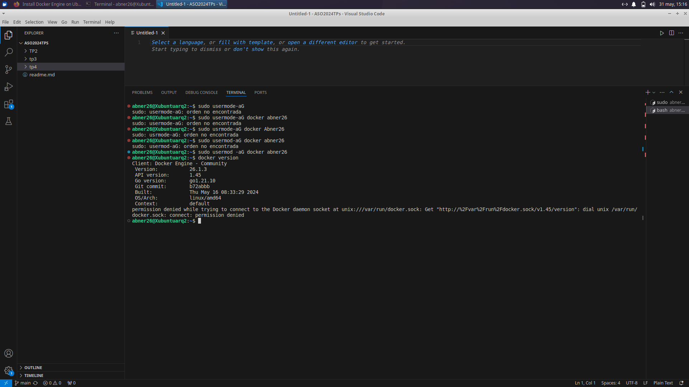
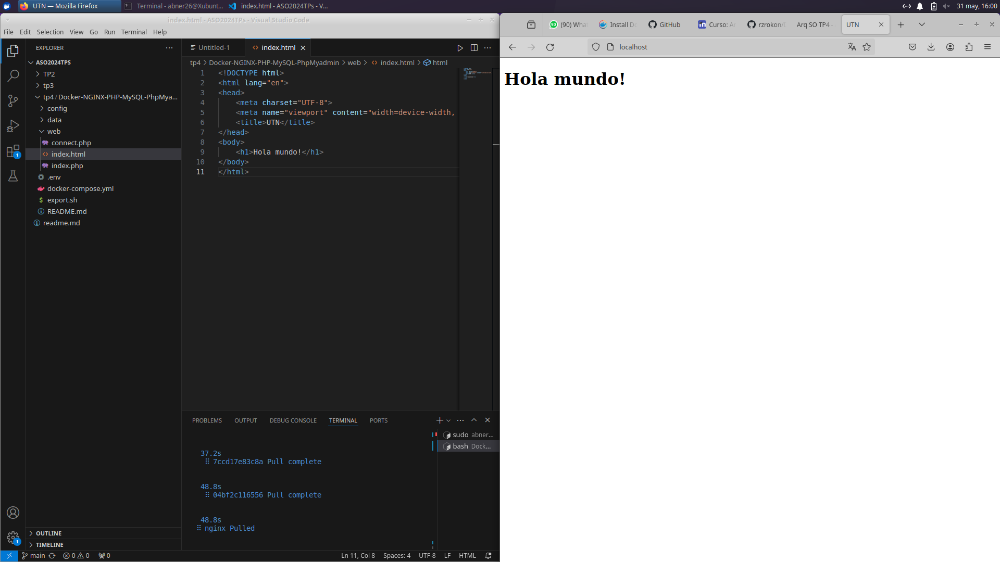
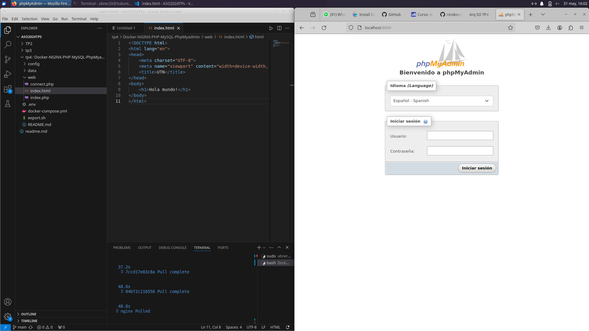
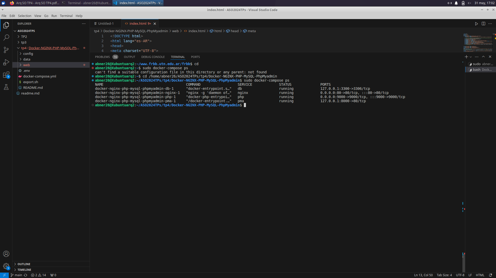

# TP3
## 1A
Se puede notar del tiempo de ejecución que es menor cuando se usan hilos porque con hilos se ejecutan procesos en paralelo.
En promedio el tiempo de ejecución con hilos es de 4.01460 segundos mientras que sin hilos es de 5.13283.

## 1B
Comparando con mi compañero, el tuvo en la ejecución con hilos 4.05920 y sin hilos tuvo 5.23259.

## 1C (Corrección)
En el código original, ambos hilos acceden y modifican la variable "acumulador" sin sincronización. Esto puede llevar a una condición de carrera, donde los hilos compiten por el acceso a acumulador, produciendo resultados impredecibles.

Al descomentar las líneas, las operaciones de incremento y decremento en los hilos no están sincronizadas, lo que intensifica el problema de la condición de carrera.

La ejecución del código sin sincronización resulta en tiempos de ejecución impredecibles debido a la condición de carrera, donde los hilos compiten por recursos compartidos sin un control adecuado.

## 2A 

<a href="./tp3/con_race_condition2.0.c">puzzle corregido</a>

## 2B
<a href="./tp3/diagrama-flujo1.0.jpeg">Diagrama - Imagen</a>

## TP4

## Capturas de Pantalla: 

### Imagen: 

### Imagen: 

### Imagen: 

### Imagen:
 

### Imagen: 

### Imagen: 

### Imagen: 

### Imagen fiinal 1: 

### Imagen final 2: 

